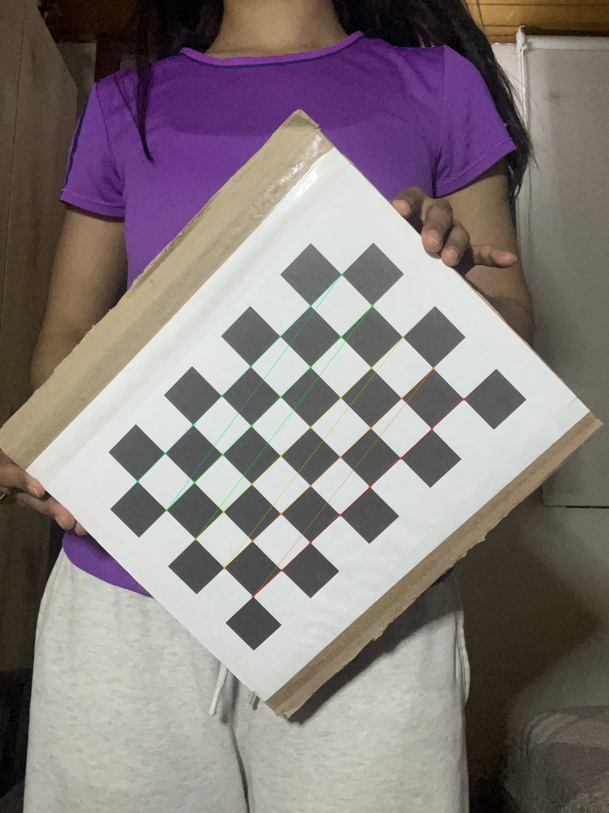

# Visión Artificial

Este repositorio contiene el avance del proyecto desarrollado para la materia de Visión Artificial.

Actualmente, el proyecto cuenta con dos módulos implementados de manera independiente con el objetivo de probar y validar sus funcionalidades de forma autónoma. Posteriormente, estos módulos serán integrados junto con las demás funcionalidades del programa.

## Módulos implementados

### Calibración de cámara

Se implementó un módulo para realizar la calibración de la cámara utilizada en la adquisición de los videos. Este proceso permite estimar los parámetros intrínsecos de la cámara y los coeficientes de distorsión.

A continuación se muestra un ejemplo de la detección de las esquinas del tablero utilizado durante el proceso de calibración:

### Estimación de pose con MediaPipe

Se implementó un módulo de estimación de pose utilizando **MediaPipe Pose Landmarker**. El módulo procesa los frames de un video y permite visualizar los landmarks corporales y las conexiones entre las articulaciones detectadas.

[Ver demostración de estimación de pose con MediaPipe](mediapipe.mp4)
